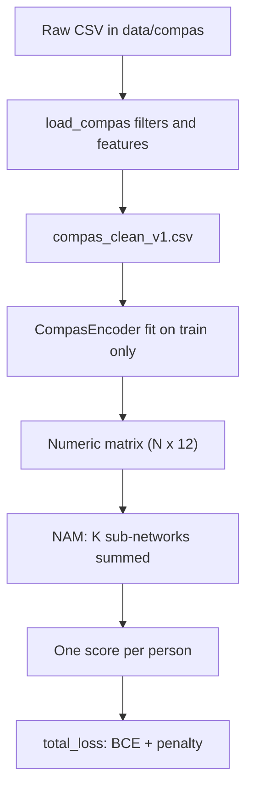

# Code structure (plain-language guide)

This document explains what each file and function does, and **how** it works, for readers who are new to **PyTorch** (the library used here for trainable models). For COMPAS cleaning details, see [preprocessing_compas.md](preprocessing_compas.md).

## What this project does

The thesis replicates **Neural Additive Models (NAM)** on the **COMPAS** recidivism dataset, then plans to extend NAMs with **CLIP** image features for medical imaging. At a high level:

1. **Data** — Load and clean COMPAS rows, then turn columns into numbers the model can read.
2. **Model** — One small neural network **per input feature**; their outputs are **added** to predict recidivism.
3. **Training** — Adjust network weights to reduce prediction error (plus optional regularization).
4. **Tests** — Automated checks that preprocessing and model shapes behave as expected.

## Concepts without PyTorch

| Term | Meaning in this repo |
|------|----------------------|
| **Tensor** | A multi-dimensional array of numbers (like a NumPy array) that can live on CPU or GPU. |
| **Batch (B)** | Several people (rows) processed together for speed. |
| **Feature (K)** | One input column after encoding (e.g. scaled age, or “race = Caucasian” as 0/1). |
| **Module / `nn.Module`** | A building block with **parameters** (weights) that are learned during training. |
| **Forward pass** | Feed inputs through the model once and get outputs (logits). |
| **Logit** | A real number before converting to a probability; higher → model favors class 1 (recidivism). |
| **Loss** | A single number measuring how wrong predictions are; training tries to **minimize** it. |
| **Dropout** | Randomly zero some activations during training to reduce overfitting; turned off in “eval” mode. |
| **Optimizer (e.g. Adam)** | Algorithm that nudges weights after each batch using gradients from `loss.backward()`. |
| **Checkpoint** | Saved file (`.pt`) with learned weights and metadata. |

There are **two** NAM implementations in `src/nam/`:

- **`NAM`** (`nam.py`) — Matches the paper replication contract (deeper `FeatureNN`, feature dropout, output penalty).
- **`NeuralAdditiveModel`** (`model.py`) — Simpler variant used by the current **`train.py`** entry point.

---

## Repository layout

| Path | Role |
|------|------|
| `configs/` | Hyperparameters (YAML); not Python, but drives training when wired up. |
| `data/compas/` | Raw and cleaned CSVs (gitignored). |
| `docs/` | Thesis docs, preprocessing notes, this file. |
| `src/data/` | COMPAS loading, cleaning, encoding. |
| `src/nam/` | NAM model and loss. |
| `src/train.py` | CLI training script (legacy path on `NeuralAdditiveModel`). |
| `src/utils/` | Metrics and random seeds. |
| `src/features/` | Future CLIP hooks (stub). |
| `src/extensions/` | Future Phase 2 work (stub). |
| `tests/` | Pytest checks. |

---

## `src/data/compas.py`

Works with **pandas** `DataFrame`s (spreadsheet-like tables). No PyTorch here.

### Constants

- **`COMPAS_COLUMNS`** — Names of numeric columns used by the **older** training path (`compas_numeric_feature_matrix`): age, priors, juvenile counts.

### `_project_root() -> Path`

**What:** Finds the repository root (two folders above this file).

**How:** Uses `Path(__file__).resolve().parents[2]` so paths work regardless of the current working directory.

### `find_compas_csv(data_dir=None) -> Path | None`

**What:** Returns the path to the **first** `.csv` in `data/compas` (alphabetically sorted), or `None` if the folder is missing or empty.

**How:** `sorted(root.glob("*.csv"))[0]`. Used by `train.py` to pick a file automatically (often `compas_clean_v1.csv` if present).

### `load_compas_frame(csv_path) -> pd.DataFrame`

**What:** Loads any COMPAS CSV with **all** columns.

**How:** `pd.read_csv(csv_path)` with no filtering. Used for quick loads and the tiny test fixture.

### `load_compas(raw_path, out_path) -> pd.DataFrame`

**What:** ProPublica-style cleaning for NAM replication: filters → six features + target → saves CSV → returns table.

**How:**

1. Read only needed columns (`usecols`) to avoid duplicate column names in the raw ProPublica file.
2. Apply four filters in order (screening window, drop `is_recid == -1`, drop charge `"O"`, drop `score_text == "N/A"`).
3. **Assert** exactly **6172** rows; otherwise raise `AssertionError`.
4. Derive `length_of_stay` from jail in/out dates; map charge F/M → 1/2; keep race/sex as strings.
5. Write columns in fixed order to `out_path` (`index=False`), return the DataFrame.

See [preprocessing_compas.md](preprocessing_compas.md) for the full spec.

### `compas_numeric_feature_matrix(df, columns=COMPAS_COLUMNS) -> (pd.DataFrame, list[str])`

**What:** Builds a numeric-only feature block for the **legacy** trainer.

**How:** Keeps only columns from `columns` that exist in `df`, converts to numbers (`errors="coerce"`), fills missing with `0.0`, returns the matrix and the list of column names actually used.

---

## `src/data/encoding.py`

Turns the **six** cleaned COMPAS columns into a **12-column** numeric matrix for `NAM` (4 scaled continuous + 6 race one-hot + 2 sex one-hot). Uses **scikit-learn**, not PyTorch.

### Constants

- **`CONTINUOUS_COLS`** — `age`, `charge_degree`, `length_of_stay`, `priors_count`.
- **`CATEGORICAL_COLS`** — `race`, `sex`.

### Class `CompasEncoder`

**What:** Learns scaling and category encoding on **training data only**, then applies the same mapping to validation/test (avoids leakage).

#### `__init__()`

**What:** Creates empty `OneHotEncoder` and `MinMaxScaler(feature_range=(-1, 1))`, sets `_fitted = False`.

**How:** Stores sklearn objects; no data yet.

#### `fit(df) -> CompasEncoder`

**What:** Records min/max for continuous columns and category lists for race/sex.

**How:**

- `MinMaxScaler.fit` on the 4 continuous columns → maps each to **[-1, 1]** on the training fold.
- `OneHotEncoder.fit` on race and sex → learns the 6 race and 2 sex columns.
- Builds `feature_names_` (e.g. `race_Caucasian`, `sex_Male`) for interpretability.

#### `transform(df) -> np.ndarray`

**What:** Returns a float32 array of shape `(N, 12)`.

**How:** Scales continuous block, one-hot encodes categoricals, concatenates horizontally. Raises if `fit` was not called.

#### `fit_transform(df) -> np.ndarray`

**What:** Convenience: `fit` then `transform` on the same DataFrame.

**How:** Calls both methods in sequence.

#### `n_features` (property)

**What:** Number of encoded columns (12 after a standard fit).

**How:** `len(self.feature_names_)`.

---

## `src/data/__init__.py`

**What:** Re-exports `COMPAS_COLUMNS`, `find_compas_csv`, `load_compas_frame` for `from src.data import ...`.

**How:** Standard Python package shortcut; does not export `load_compas` or `CompasEncoder` yet.

---

## `src/nam/feature_nn.py`

### Class `FeatureNN(nn.Module)`

**What:** One **small neural network for a single input feature** (one number in, one contribution out per person).

**How (architecture):**

- Input shape `(batch, 1)` — one feature value per row.
- Three hidden blocks: `Linear → ReLU → Dropout`, sizes 1→64→64→32.
- Final `Linear(32, 1, bias=False)` → one scalar per person.
- `forward`: if input is 1-D, adds a column dimension, runs `self.net`, squeezes back to `(batch,)`.

This is the “shape function” for one feature in the NAM paper.

---

## `src/nam/nam.py`

### Class `NAM(nn.Module)`

**What:** Full **Neural Additive Model**: **K** separate `FeatureNN`s (one per encoded column), sum their outputs, add a learnable **bias**, optional **feature dropout**.

#### `__init__(n_features, dropout=0.1, feature_dropout=0.05)`

**What:** Creates `n_features` copies of `FeatureNN`, a dropout layer on the **stacked** per-feature outputs, and `bias` initialized to 0.

**How:** `nn.ModuleList` holds one sub-network per column index `0 … K-1`.

#### `calc_outputs(x) -> list[torch.Tensor]`

**What:** Returns **K** tensors, each shape `(B,)`, one per feature **before** feature dropout and **without** adding bias.

**How:** For each index `i`, passes `x[:, i]` into `feature_nns[i]`. Honors train/eval mode for **internal** dropout inside each `FeatureNN`, but does **not** apply `feature_dropout` or `bias` (used for interpretability plots and the output penalty).

#### `forward(x) -> torch.Tensor`

**What:** Full model prediction: logits shape `(B,)`.

**How:**

1. `calc_outputs(x)` → list of K vectors.
2. `torch.stack` → `(B, K)`.
3. `feature_dropout` on that matrix (training only).
4. Sum across features + `bias`.

Interpretation: predicted logit ≈ bias + (possibly dropped) sum of per-feature contributions.

---

## `src/nam/model.py`

Older / alternate NAM used by `train.py` and `test_compas_regression.py`.

### Class `_FeatureSubnetwork(nn.Module)`

**What:** One feature’s sub-network with configurable hidden widths.

**How:** Chains `Linear → ReLU` for each size in `hidden_dims`, then `Linear → 1` output. `forward` unsqueezes the scalar feature to shape `(B, 1)` before the linear stack.

### Class `NeuralAdditiveModel(nn.Module)`

**What:** `num_features` sub-networks; outputs are **summed** (plus optional bias). No feature dropout or output penalty.

#### `__init__(num_features, hidden_dims=(64, 64), output_bias=True)`

**What:** Builds one `_FeatureSubnetwork` per feature and optional scalar bias parameter.

#### `forward(x) -> torch.Tensor`

**What:** Logits `(B,)` from input `(B, num_features)`.

**How:** For each feature index `i`, runs `subnets[i](x[:, i])`, stacks, sums along features, adds bias if present.

---

## `src/nam/losses.py`

Loss terms for the **paper-style** `NAM` (not used by default in `train.py` yet).

### `output_penalty(model, x) -> torch.Tensor`

**What:** Mean squared value of per-feature outputs (regularizer from the reference implementation).

**How:**

1. Temporarily sets `model.eval()` so dropout is off (deterministic).
2. Calls `model.calc_outputs(x)`, stacks to `(B, K)`.
3. Returns mean of squares: `(outputs**2).mean()`.
4. Restores prior train/eval mode so training is unaffected.

### `total_loss(model, x, y, output_reg, l2_reg=0.0) -> torch.Tensor`

**What:** Training loss = **binary cross-entropy on logits** + optional `output_reg * output_penalty`.

**How:**

1. `logits = model(x)`.
2. `_bce(logits, y.float())` — compares logits to 0/1 labels.
3. If `output_reg > 0`, adds weighted penalty. `l2_reg` is reserved but unused (0 in the contract).

---

## `src/nam/__init__.py`

**What:** Public exports: `FeatureNN`, `NAM`.

**How:** `from src.nam.feature_nn import ...` etc. `NeuralAdditiveModel` lives in `model.py` and is imported directly where needed (`train.py`).

---

## `src/train.py`

Command-line training loop (currently on the **legacy** data path).

### `load_config(path) -> dict`

**What:** Reads YAML or JSON config into a Python dictionary.

**How:** Opens file; uses `yaml.safe_load` for `.yaml`/`.yml`, else `json.load`.

### `main()`

**What:** End-to-end stub trainer: load config → find CSV → build tensors → train `NeuralAdditiveModel` → save checkpoint.

**How (step by step):**

1. Parse `--config` from the command line.
2. Set random seed (`torch.manual_seed`).
3. `find_compas_csv` → `load_compas_frame` → `compas_numeric_feature_matrix`.
4. Convert features and `two_year_recid` to `torch.tensor` on CPU/GPU.
5. `TensorDataset` + `DataLoader` with shuffled batches.
6. Build `NeuralAdditiveModel`, Adam optimizer, BCE or MSE loss.
7. Each epoch: for each batch, `zero_grad` → forward → `loss.backward()` → `optimizer.step()`.
8. Save `results/nam_compas_last.pt` with weights, feature names, and config.

**Note:** This path does **not** yet call `load_compas`, `CompasEncoder`, or `NAM` / `total_loss`. Replication training should wire those in separately.

---

## `src/utils/metrics.py`

Evaluation helpers (NumPy + sklearn, no PyTorch).

### `compute_auc_roc(y_true, y_score) -> float`

**What:** **ROC AUC** — how well scores rank positives above negatives (0.5 = random, 1.0 = perfect).

**How:** Wraps `sklearn.metrics.roc_auc_score`.

### `compute_auc_pr(y_true, y_score) -> float`

**What:** **Average precision** (PR AUC), often more informative on imbalanced data.

**How:** Wraps `sklearn.metrics.average_precision_score`.

---

## `src/utils/seeding.py`

### `seed_everything(seed: int) -> None`

**What:** Makes random runs reproducible (Python, NumPy, PyTorch, CUDA).

**How:** Sets `random.seed`, `np.random.seed`, `torch.manual_seed`, CUDA seeds if available, and cudnn flags for deterministic behavior (may slow GPU training slightly).

---

## `src/features/clip_extract.py`

Future CLIP integration (not active in Phase 1 COMPAS work).

### `clip_available() -> bool`

**What:** Returns whether `open_clip` can be imported.

**How:** Tries `import open_clip`; catches `ImportError`.

### `extract_image_features(_images, _model_name="ViT-B-32") -> Any`

**What:** Placeholder for image → CLIP embedding.

**How:** Currently always raises `NotImplementedError`.

---

## `src/features/__init__.py` and `src/extensions/__init__.py`

**What:** Package markers with short docstrings only (no functions).

---

## `src/__init__.py`

**What:** Marks `src` as a Python package (docstring only).

---

## Tests

Tests are run with **pytest** (`pytest tests/ -q`). They do not train a full production model unless noted.

### `tests/test_compas_preprocessing.py`

| Test | What it checks |
|------|----------------|
| `test_load_compas_preprocessing_sanity` | After `load_compas`, row count 6172, value ranges, category sets, charge encoding; output file exists. Skips if raw CSV missing. |
| `test_load_compas_writes_versioned_csv_under_data_compas` | Writes `data/compas/compas_clean_v1.csv` when raw data is present. |

### `tests/test_compas_regression.py`

| Test | What it checks |
|------|----------------|
| `test_compas_fixture_loads_and_shapes_match` | Tiny fixture CSV loads; numeric matrix aligns with row count. |
| `test_nam_forward_and_single_step_over_compas_fixture` | `NeuralAdditiveModel` forward pass works; 30 Adam steps do not increase loss on the fixture. |

### `tests/test_nam_unit.py`

Uses synthetic data and `configs/compas_replication.yaml` (no real COMPAS file).

| Test | What it checks |
|------|----------------|
| `test_feature_nn_shape` | `FeatureNN` output shape `(B,)`. |
| `test_feature_nn_layer_count` | Exactly 4 linear layers; last has no bias. |
| `test_nam_output_shape` | `NAM` logits shape and dtype. |
| `test_output_penalty_no_dropout` | `output_penalty` is deterministic even when model is in train mode. |
| `test_loss_increases_with_penalty` | `total_loss` with `output_reg > 0` exceeds BCE-only loss. |
| `test_encoder_column_count` | `CompasEncoder` → 12 columns and expected names. |
| `test_encoder_range` | Encoded values in [-1, 1]. |
| `test_seeding_reproducibility` | Same seed → same `NAM` output; different seed → different output. |
| `test_encoder_column_layout` | Continuous vs one-hot blocks behave as designed. |
| `test_calc_outputs_no_feature_dropout_no_bias` | `calc_outputs` skips feature dropout; `forward` = sum + bias. |

---

## Config files (not Python)

### `configs/compas_replication.yaml`

Hyperparameters for the **paper-style** path: dropout, `output_reg`, learning rate, batch size, cross-validation settings, etc. Consumed by `test_nam_unit.py` and intended for a full replication trainer (not yet fully wired to `train.py`).

### `configs/example_compas.yaml`

Simpler example used by the README for `python -m src.train --config ...`.

---

## How the pieces fit together (today vs planned)

| Stage | Implemented in | Used by `train.py` today? |
|-------|------------------|---------------------------|
| Raw → clean COMPAS | `load_compas` | No |
| Clean → 12-D encoding | `CompasEncoder` | No |
| NAM (paper) | `NAM`, `total_loss` | No |
| Legacy numeric columns | `compas_numeric_feature_matrix` | Yes |
| Legacy NAM | `NeuralAdditiveModel` | Yes |

**Planned replication path:** `load_compas` → train/val split → `CompasEncoder.fit` on train → `NAM` + `total_loss` + metrics in `src/utils/metrics.py`, driven by `configs/compas_replication.yaml`.
